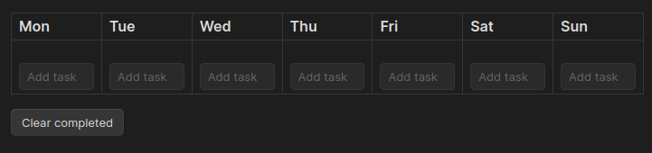
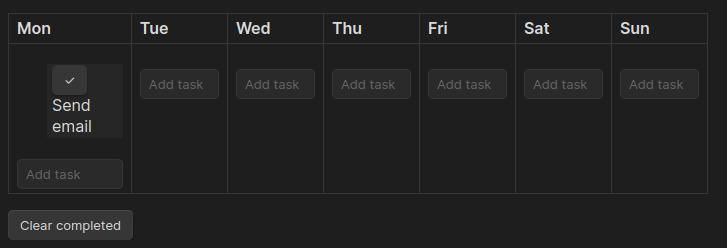
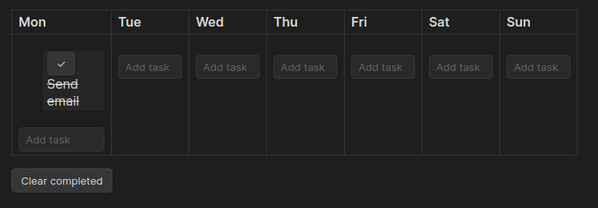
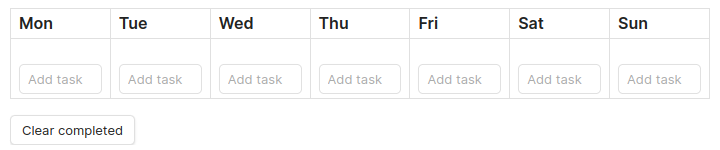
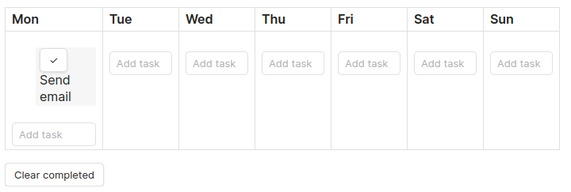
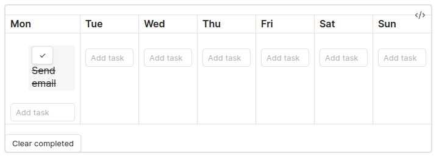

# Organizer

This is a simple no-frills [Obsidian](https://obsidian.md) plugin to organize your week.
It provides you with a table representing your week, with one column per day. You can click on a cell to add a task for that day, 
mark tasks as completed and clear all completed tasks at the press of a button. Supports multiple languages and changing
the starting day of the week.

## Screenshots

## Development

Quick starting guide for new plugin devs:

- Clone this repo to a local development folder. For convenience, you can place this folder in your `.obsidian/plugins/organizer` folder.
- Install NodeJS.
- Run `npm i` or `yarn` to install dependencies.
- Run `npm run dev` to compile this plugin from `main.ts` to `main.js`.
- Make changes. Those changes should be automatically compiled into `main.js`.
- Reload Obsidian to load the new version of your plugin, or install and enable the [Hot Reload](https://github.com/pjeby/hot-reload) plugin.
- Enable Organizer in the settings window.
- See [Obsidian API's documentation](https://github.com/obsidianmd/obsidian-api).

## Manually installing the plugin

- Clone this repo inside a subdirectory of your vault's plugin directory `VaultFolder/.obsidian/plugins/`.

